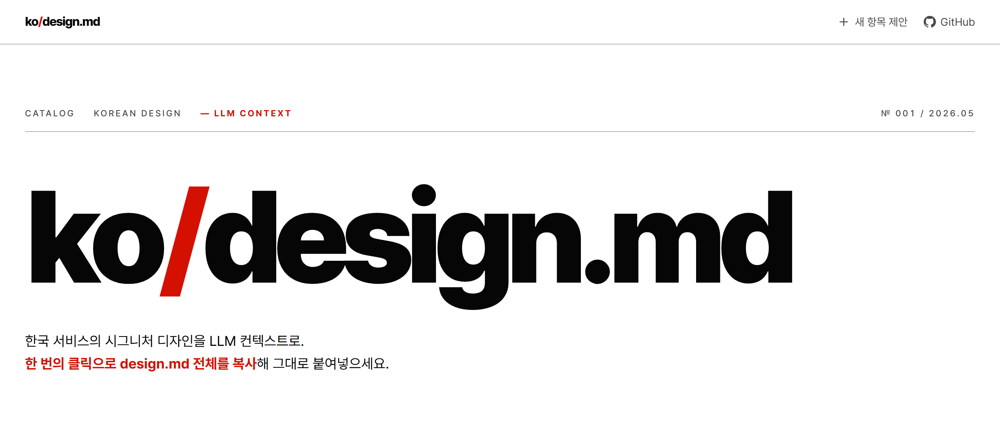

<div align="center">

<a href="https://getdesign.kr">
  
</a>

# ko-design-md

**한국 브랜드 디자인 시스템을 Stitch v0.1 마크다운으로 정리한 오픈 카탈로그**

[](./LICENSE)
[](./LICENSE-CONTENT)
[](https://github.com/CaesiumY/ko-design-md/actions/workflows/ci.yml)
[](https://github.com/CaesiumY/ko-design-md/stargazers)
[](https://github.com/CaesiumY/ko-design-md/commits/main)

**🔗 라이브 카탈로그 → [getdesign.kr](https://getdesign.kr)**

</div>

---

## ko-design-md란?

한국에서 운영되는 브랜드/서비스의 디자인 시스템(컬러·타이포그래피·컴포넌트·인터랙션 원칙)을 **Stitch v0.1** 구조화 마크다운으로 정리한 오픈 카탈로그입니다. 흩어지고, 비교하기 어렵고, 시간이 지나면 사라지는 디자인 시스템 자료를 다음 세 원칙으로 한곳에 모읍니다.

- **단일 형식** — 모든 항목이 동일한 frontmatter + 섹션 구조라 비교·검색·임베딩이 쉬움
- **자동화된 기여 흐름** — AI 코딩 에이전트용 [`/design-md` 스킬](#새-항목-기여)이 13단계 파이프라인으로 새 항목을 자동 생성
- **시각적 검증** — 항목마다 light/dark 프리뷰 HTML과 OG 이미지를 함께 보관

대상은 디자인 시스템을 **다루는** 디자이너·엔지니어, 그리고 한국 브랜드의 디자인 결정을 **연구하는** 사람입니다.

## 겉모습은 빌리되, 비즈니스는 베끼지 마세요

각 항목은 브랜드의 **시각/디자인 언어**(색·타이포·간격·컴포넌트의 *시각 패턴*)를 기술합니다. design.md를 AI 코딩 에이전트에 넣어 자기 제품을 만들 때는, 그 시각 패턴을 **자기 도메인에 맞게 번안**하세요.

- ✅ **차용**: 색 팔레트, 타이포 스케일, 간격 리듬, 컴포넌트의 시각 처리(둥글기·그림자·밀도)
- ❌ **이식 금지**: 출처 브랜드의 제품 개념·플로우·카피 — 예) 토스의 송금 흐름, 배민의 ETA 의미를 성격이 다른 앱에 그대로 가져오기

`## Components`가 도메인 특화 이름(`button-cta`="구매하기", `EtaBanner`)을 쓰는 것은 출처를 정확히 기록하기 위함이지, 그 도메인을 함께 복사하라는 뜻이 아닙니다.

## 카탈로그를 코딩 에이전트에서 바로 쓰기 — `use-design-md` 스킬

호환되는 AI 코딩 에이전트라면 위 "차용" 과정을 [`use-design-md` 스킬](./.claude/skills/use-design-md/SKILL.md)로 자동화할 수 있습니다. 브랜드명만 주면 카탈로그에서 해당 `design.md`를 찾아 받아와 **지금 작업 중인 프로젝트**의 UI에 그 디자인 언어(색·타이포·간격·둥글기·컴포넌트)를 입힙니다. 카탈로그를 *읽는* 쪽이라 **어느 repo에서든 동작**합니다(새 항목을 *추가*하는 `/design-md` 생산자 스킬과 역할이 반대).

### 설치 (택1)

**모든 에이전트 (Claude Code·Cursor·Codex·Gemini 등) — [skills.sh](https://skills.sh)**

```bash
npx skills add CaesiumY/ko-design-md          # use-design-md 스킬 설치
npx skills add CaesiumY/ko-design-md --list   # 포함 스킬 확인
```

→ 설치 후 호출: `/use-design-md`

**Claude Code 플러그인 마켓플레이스 (공식 채널)**

```text
/plugin marketplace add CaesiumY/ko-design-md
/plugin install ko-design-md@ko-design-md
```

→ 설치 후 호출: `/ko-design-md:use-design-md`

설치하면 한 줄로 적용됩니다.

```text
토스 디자인으로 이 대시보드 다시 꾸며줘
```

내부적으로는 카탈로그 인덱스([`getdesign.kr/llms.txt`](https://getdesign.kr/llms.txt))로 슬러그를 찾고, 항목별 원본(`getdesign.kr/services/{slug}/llms.txt`)을 평문으로 받아 적용합니다. skills.sh를 쓰지 않는 도구라면 [`.claude/skills/use-design-md/`](./.claude/skills/use-design-md/) 디렉터리를 해당 도구의 스킬 경로로 복사하세요. 가져올 수 있는 브랜드 목록은 라이브 카탈로그 **[getdesign.kr](https://getdesign.kr)**에서 확인할 수 있습니다.

## 항목 구성

각 항목은 다음 4종으로 구성됩니다.

| 산출물 | 위치 | 역할 |
|--------|------|------|
| 카탈로그 마크다운 | `services/{slug}.md` | Stitch v0.1 frontmatter + 본문 |
| 라이트 프리뷰 | `public/preview/{slug}/light.html` | 자급자족형 single-file 미리보기 |
| 다크 프리뷰 | `public/preview/{slug}/dark.html` | 다크 테마 미리보기 |
| OG 이미지 | `public/og/{slug}.png` | 소셜 카드용 1200×630 |

작성 규격(frontmatter 필드·카테고리 enum 등)은 [docs/PRD.md](./docs/PRD.md)와 [stitch-format.md](./.claude/skills/design-md/references/stitch-format.md)를 참고하세요.

## 빠른 시작

```bash
git clone https://github.com/CaesiumY/ko-design-md.git
cd ko-design-md
pnpm install      # pnpm 필요
pnpm dev          # → http://localhost:3000
pnpm build        # OG 이미지 생성 + 사이트 빌드
```

요구사항: Node 20+, pnpm.

## 새 항목 기여

호환되는 AI 코딩 에이전트에서 [`/design-md` 스킬](./CONTRIBUTING.md#1-새-항목-추가-권장-design-md-스킬-사용)을 한 줄로 호출하면 research → draft → review → preview HTML → OG까지 13단계로 자동 생성됩니다.

```text
/design-md
{브랜드/서비스명}을 ko-design-md에 새 카탈로그 항목으로 추가해 주세요.
```

생성된 4종(`services/{slug}.md`, light/dark `.html`, `og/{slug}.png`)을 `pnpm dev`로 확인하고, 한 커밋(`git commit -s` — DCO 서명)으로 묶어 PR을 올립니다. 사전 준비·13단계 상세·PR 체크리스트는 **[기여 가이드](./CONTRIBUTING.md)**를 참고하세요. 스킬 없이 손으로 기여하려면 [수동 PR 절차](./CONTRIBUTING.md#2-기존-항목-수정-스킬-미사용)를 따릅니다.

## 라이선스

본 리포는 **3-tier** 라이선스 구조를 가집니다.

| 대상 | 라이선스 | 파일 |
|------|----------|------|
| 코드 (`src/`, `scripts/`, 설정 파일) | MIT | [LICENSE](./LICENSE) |
| 카탈로그 콘텐츠 (`services/*.md`, `public/preview/**`, `public/og/**`) | CC BY 4.0 | [LICENSE-CONTENT](./LICENSE-CONTENT) |
| 브랜드 자산 (`public/logos/*`) | 각 권리자 정책 | [NOTICE](./NOTICE) |

브랜드 로고는 식별·참조 목적으로 포함된 것이며 카탈로그 라이선스로 재배포되지 않습니다. 로고·콘텐츠 삭제 요청은 [SECURITY.md의 Takedown 안내](./SECURITY.md#브랜드-자산콘텐츠-삭제-요청-takedown)를 따릅니다.

## 링크

- [기여 가이드](./CONTRIBUTING.md) · [행동 강령](./CODE_OF_CONDUCT.md) · [보안 정책](./SECURITY.md) · [변경 이력](./CHANGELOG.md)
- [PRD](./docs/PRD.md) — 프로젝트 방향성 문서
- [GitHub Issues](https://github.com/CaesiumY/ko-design-md/issues)

---

<div align="center">
<sub>AI-assisted workflow · Made for Korean designers and developers</sub>
</div>
