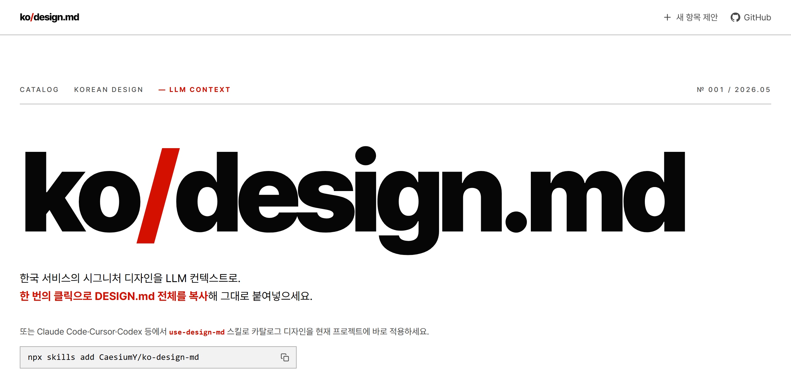

<div align="center">

<a href="https://getdesign.kr">
  
</a>

# ko-design-md

**한국 브랜드의 디자인 언어를, 출처가 달린 DESIGN.md 한 장으로**

[](./LICENSE)
[](./LICENSE-CONTENT)
[](https://github.com/CaesiumY/ko-design-md/actions/workflows/ci.yml)
[](https://github.com/CaesiumY/ko-design-md/stargazers)
[](https://github.com/CaesiumY/ko-design-md/commits/main)

**🔗 라이브 카탈로그 → [getdesign.kr](https://getdesign.kr)**

</div>

---

## ko-design-md란?

LLM이나 코딩 에이전트에 "토스처럼 만들어 줘"라고 하면 결과가 매번 다르고, 그 브랜드답게 나오지도 않습니다. 브랜드가 공개한 디자인 자료는 여기저기 흩어져 있고 형식도 제각각이라 컨텍스트로 그대로 넣기 어렵습니다.

ko-design-md는 한국 브랜드의 디자인 언어(색·타이포그래피·간격·컴포넌트·원칙)를 브랜드당 **DESIGN.md** 한 장으로 정리한 오픈 카탈로그입니다. 모든 항목이 같은 형식이라 사람은 나란히 비교하며 읽고, 에이전트는 받아서 그대로 씁니다. 어떤 브랜드가 실려 있는지는 [getdesign.kr](https://getdesign.kr)에서 볼 수 있습니다.

## 바로 쓰기

### 1. 사이트에서 복사하기

[getdesign.kr](https://getdesign.kr)에서 브랜드를 고르고, 상세 페이지의 **DESIGN.md 전체 복사** 버튼을 누르거나 파일로 내려받아 쓰고 있는 채팅·IDE에 붙여넣습니다. 가입도 설치도 필요 없습니다.

### 2. 코딩 에이전트에 스킬로 붙이기 — `use-design-md`

[`use-design-md` 스킬](./.claude/skills/use-design-md/SKILL.md)은 브랜드명만 받아 카탈로그에서 해당 DESIGN.md를 찾아 오고, **지금 작업 중인 프로젝트**의 UI에 그 디자인 언어를 입힙니다. 카탈로그를 읽기만 하므로 어느 저장소에서든 동작합니다(새 항목을 만드는 `/design-md` 스킬과는 반대 역할입니다).

**모든 에이전트 (Claude Code·Cursor·Codex·Gemini 등) — [skills.sh](https://skills.sh)**

```bash
npx skills add CaesiumY/ko-design-md          # use-design-md 스킬 설치
npx skills add CaesiumY/ko-design-md --list   # 포함 스킬 확인
```

→ 설치 후 호출: `/use-design-md`

**Claude Code 플러그인 마켓플레이스 (공식 채널)**

```text
/plugin marketplace add CaesiumY/ko-design-md
/plugin install ko-design-md@ko-design-md
```

→ 설치 후 호출: `/ko-design-md:use-design-md`

설치하고 나면 한 줄이면 됩니다.

```text
토스 디자인으로 이 대시보드 다시 꾸며줘
```

스킬은 아래 3번의 카탈로그 색인으로 브랜드를 찾고, 항목별 DESIGN.md를 평문으로 받아 적용합니다. skills.sh를 쓰지 않는 도구라면 [`.claude/skills/use-design-md/`](./.claude/skills/use-design-md/) 디렉터리를 그 도구의 스킬 경로로 복사하세요.

### 3. 주소로 직접 가져가기

도구나 스크립트가 읽는 주소입니다. 모두 `https://getdesign.kr` 아래에 있고, `{slug}`는 상세 페이지 URL의 마지막 부분입니다.

| 주소 | 내용 |
|------|------|
| `/llms.txt` | 카탈로그 색인 — 모든 항목을 한 줄씩 |
| `/services/{slug}/llms.txt` | 항목의 DESIGN.md 그대로 (인용·References·메타데이터 포함) |
| `/services/{slug}/DESIGN.md` | [DESIGN.md 명세](https://github.com/google-labs-code/design.md)만 아는 도구용 발행본 (명세에 자리가 없는 날짜·로고는 빠짐) |
| `/.well-known/agent-skills/index.json` | 소비자 스킬 색인 |

정규 URL(`/`, `/services/{slug}`)도 `Accept: text/markdown`으로 요청하면 HTML 대신 마크다운을 돌려줍니다.

## 믿고 쓸 수 있는 이유

값을 가져다 쓰려면 그게 정말 그 브랜드의 값인지 되짚을 수 있어야 합니다. 항목마다 다음을 지킵니다.

- **주장에는 출처 번호가 붙습니다.** 본문의 `[src:N]`은 문서 끝 `## References`의 N번째 자료를 가리키고, 출처는 누구나 열어 볼 수 있는 공개 자료만 씁니다.
- **모르는 것은 모른다고 적습니다.** 공개 자료로 대조하지 못한 값과 철회한 주장은 `## Known Gaps`에 모읍니다. 브랜드 발행물과 다시 대조한 결과는 해당 섹션 첫머리에 날짜와 함께 남깁니다.
- **색은 OKLCH로 적고 브랜드 hex를 곁에 둡니다.** 둘이 맞는지는 기계가 대조합니다.
- **병합 전에 기계 게이트를 통과해야 합니다.** CI가 frontmatter·섹션 순서·인용 번호·토큰 사이드카·프리뷰 구조를 검사하고, DESIGN.md 명세의 공식 린터도 돌립니다. 명세가 표현하지 못하는 브랜드 발행값(`50%` radius, 다중 스톱 그라디언트)은 버리지 않고 알려진 한계로 기록합니다.
- **프리뷰로 눈으로 확인합니다.** 항목마다 그 디자인 언어로 그린 가상의 화면이 라이트·다크 두 테마로 딸려 있습니다.

## 겉모습은 빌리되, 비즈니스는 베끼지 마세요

각 항목은 브랜드의 **시각/디자인 언어**(색·타이포·간격·컴포넌트의 *시각 패턴*)를 기술합니다. DESIGN.md를 AI 코딩 에이전트에 넣어 자기 제품을 만들 때는, 그 시각 패턴을 **자기 도메인에 맞게 번안**하세요.

- ✅ **차용**: 색 팔레트, 타이포 스케일, 간격 리듬, 컴포넌트의 시각 처리(둥글기·그림자·밀도)
- ❌ **이식 금지**: 출처 브랜드의 제품 개념·플로우·카피 — 예) 토스의 송금 흐름, 배민의 ETA 의미를 성격이 다른 앱에 그대로 가져오기

`## Components`가 도메인 특화 이름(`button-cta`="구매하기", `EtaBanner`)을 쓰는 것은 출처를 정확히 기록하기 위함이지, 그 도메인을 함께 복사하라는 뜻이 아닙니다.

## 항목 구성

항목 하나는 다음 세 파일로 이뤄집니다.

| 파일 | 위치 | 역할 |
|------|------|------|
| DESIGN.md | `services/{slug}.md` | frontmatter(메타데이터·토큰) + 본문. 항목의 정본 |
| 토큰 사이드카 | `services/{slug}.tokens.json` | DESIGN.md 의 토큰에서 `pnpm tokens:build` 가 만든 파생물 (직접 편집하지 않음 — `pnpm tokens:check` 가 대조) |
| 프리뷰 | `public/preview/{slug}/preview.html` | 라이트·다크 두 테마를 함께 담은 자급자족형 HTML 한 장 |

소셜 카드용 OG 이미지(`public/og/{slug}.png`, 1200×630)는 빌드가 만들고 커밋하지 않습니다.

DESIGN.md는 Stitch의 섹션 구조에 DESIGN.md 명세의 토큰 맵과 이 카탈로그의 인용 규약을 더한 **카탈로그 형식**을 따릅니다. 세부 규격의 정본은 [stitch-format.md](./.claude/skills/design-md/references/stitch-format.md)(본문 섹션 구조·토큰 표현)와 [기여 가이드](./CONTRIBUTING.md)(frontmatter 필드는 1절 체크리스트, slug·카테고리·언어 값 규칙은 [3절](./CONTRIBUTING.md#3-slug--카테고리--언어-태그-규칙))입니다.

## 로컬에서 사이트 띄우기

```bash
git clone https://github.com/CaesiumY/ko-design-md.git
cd ko-design-md
pnpm install      # pnpm 필요
pnpm dev          # → http://localhost:3000
pnpm build        # OG 이미지 생성 + 사이트 빌드
```

요구사항: Node 22.22.2 이상, pnpm 10.

## 새 항목 기여

새 브랜드를 카탈로그에 들이는 온보딩은 [`/design-md` 스킬](./CONTRIBUTING.md#1-새-항목-추가-권장-design-md-스킬-사용)이 진행합니다. 조사 → 초안 → 기계 게이트 → 리뷰 → 사용자 확인 → 프리뷰 → OG 이미지 순서이고, 사람은 사용자 확인 단계에서 초안을 승인합니다. 스킬이 서브에이전트 여러 개를 부르므로 Claude Code처럼 로컬 스킬·에이전트 워크플로를 실행할 수 있는 도구가 필요합니다.

```text
/design-md
{브랜드/서비스명}을 ko-design-md에 새 카탈로그 항목으로 추가해 주세요.
```

만들어진 세 파일(`services/{slug}.md`, `services/{slug}.tokens.json`, `public/preview/{slug}/preview.html`)을 `pnpm dev`로 확인하고, 한 커밋(`git commit -s` — DCO 서명)으로 묶어 PR을 올립니다. 사전 준비·단계별 상세·PR 체크리스트는 **[기여 가이드](./CONTRIBUTING.md)**에 있습니다. 스킬 없이 손으로 고치려면 [수동 PR 절차](./CONTRIBUTING.md#2-기존-항목-수정-스킬-미사용)를 따릅니다.

## 라이선스

본 리포는 **3-tier** 라이선스 구조를 가집니다.

| 대상 | 라이선스 | 파일 |
|------|----------|------|
| 코드 (`src/`, `scripts/`, 설정 파일) | MIT | [LICENSE](./LICENSE) |
| 카탈로그 콘텐츠 (이 저장소가 저작한 산문·토큰 표현·프리뷰 레이아웃 — 범위와 예외는 LICENSE-CONTENT 참조) | CC BY 4.0 | [LICENSE-CONTENT](./LICENSE-CONTENT) |
| 브랜드 자산 (`public/logos/*`, `public/preview/*/assets/*`) | 각 권리자 정책 | [NOTICE](./NOTICE) |

브랜드 로고와 프리뷰에 삽입된 브랜드 이미지는 식별·참조 목적으로 포함된 것이며 카탈로그 라이선스로 재배포되지 않습니다. 로고·콘텐츠 삭제 요청은 [SECURITY.md의 Takedown 안내](./SECURITY.md#브랜드-자산콘텐츠-삭제-요청-takedown)를 따릅니다.

## 더 읽을거리

- [기여 가이드](./CONTRIBUTING.md) · [행동 강령](./CODE_OF_CONDUCT.md) · [보안 정책](./SECURITY.md) · [변경 이력](./CHANGELOG.md)
- [제품 스펙](./docs/PRD.md) — 문제·해법·사용자 스토리·범위를 정하는 살아있는 문서
- [용어집](./CONTEXT.md) · [결정 기록(ADR)](./docs/adr/) — 이 저장소가 쓰는 말과, 그렇게 정한 이유
- [GitHub Issues](https://github.com/CaesiumY/ko-design-md/issues)

---

<div align="center">
<sub>AI-assisted workflow · Made for Korean designers and developers</sub>
</div>
